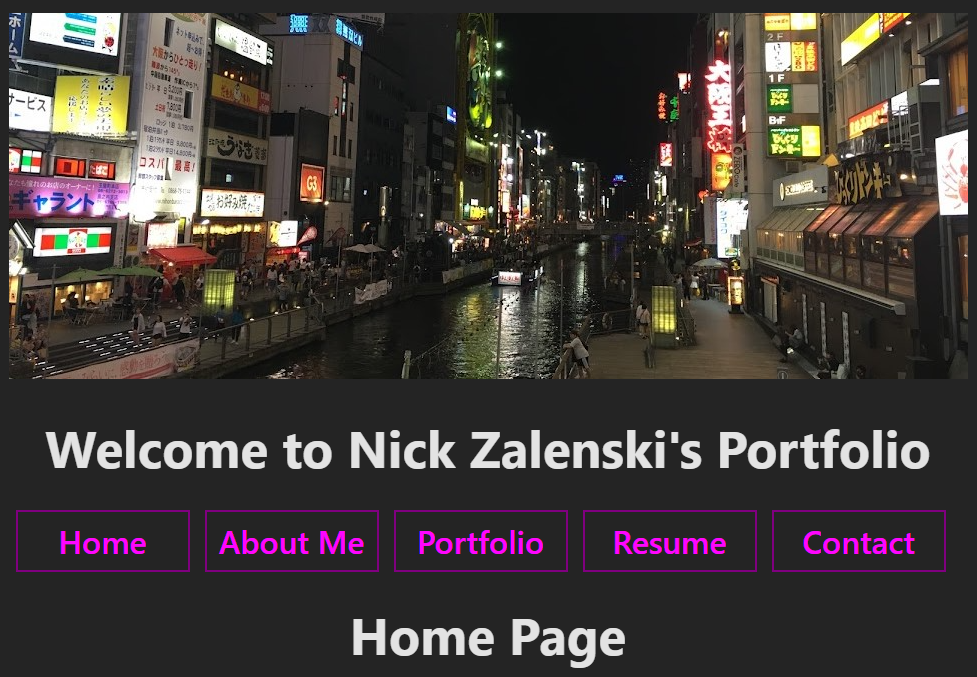

# React Portfolio

  ## Description
  This is a simple portfolio website built using React. It uses conditionals for its tabs and contains my resume and other information about myself. The site is still in its early stages, and I should tinker with it in the future.

  ## Table of Contents
  [Installation](#installation)

  [Usage](#usage)

  [Contributing](#contributing)

  [Tests](#tests)

  [Questions](#questions)

  ## Installation
  The easiest way to view this is to go to https://nickzportfolio.netlify.app. Otherwise, after pulling this repo onto your device, cd in Develop and run "npm i" and then "npm start".

  ## Usage
  Click on the tabs to go to different pages. Click on the names of my projects to go to their GitHub pages. Download my resume on its page. The contact section isn't functional as of now but may be in the future. Click on the links in the footer to go to my GitHub and LinkedIn.

  ## Screenshot
  
  
  (From an old build)

  ## Contributing
  Feel free to use this as the basis for your portfolio, as long as you take care to edit out information pertaining to me.

  ## Tests
  Make sure all links work, my resume downloads, and the contact section notifies you when something isn't filled out right.

  ## Questions
  My GitHub: https://github.com/ElBoyTM

  My email: nszalenski@gmail.com
